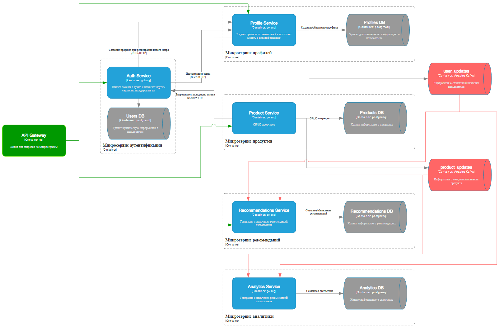
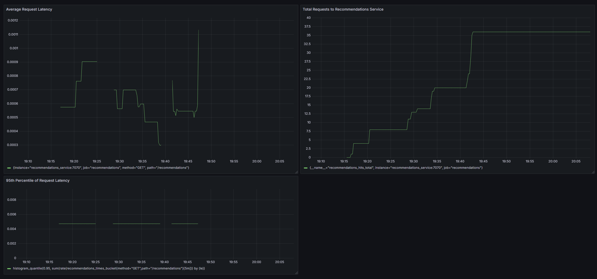

# Микросервисная система рекомендаций

Проект представляет собой микросервисную систему, реализованную на Go, которая имитирует работу рекомендательной системы интернет-магазина. 

## Основные возможности
- Генерация персонализированных рекомендаций для пользователей.
- Поддержка событий, таких как создание товара, обновление тегов и просмотр продуктов.
- Сбор метрик и мониторинг работы системы.

## Архитектура

- **Аутентификация:** упрощенная через JWT-токены (хранятся в cookies 24 часа, без refresh-токенов). Токены содержат ID пользователя и его роль.
- **Кэширование:** Redis для хранения пользовательских рекомендаций.
- **СУБД:** PostgreSQL, реализован паттерн "Database per service".
- **Микросервисное взаимодействие:** Kafka, используемые топики:
  - `user_update` — обновление интересов пользователя.
  - `product_update` — обновление тегов товара.
  - `product_create` — создание нового товара.
  - `view_product` — информация о просмотре товара.
- **API-гейтвей:** Traefik
- **Инструменты развёртывания:** Docker и docker-compose.
- **Миграции:** утилита `migrate`.
- **Мониторинг:** Prometheus и Grafana для сбора и визуализации метрик (количество запросов, время отклика).
- **Настройки:** Viper для конфигураций.
- **Веб-сервер:** httprouter.
- **Логирование:** zap.

### Пример метрик в Grafana


### Требования
- Go 1.21
- Docker

## Установка и запуск
1. Склонируйте репозиторий:
   ```bash
   git clone https://gitverse.ru/sbertech_hr/Go-internship-cyansnbrst
2. Запустите Docker.
3. Запустите базовую инфраструктуру через docker-compose:
    ```bash
    docker-compose up -d
4. Если сервисы не запускаются, выполните следующие шаги вручную:
    * Запустите Kafka, Redis и PostgreSQL.
    * Выполните миграции базы данных (запустите сервис migrate).
    * Инициализируйте Kafka (запустите сервис kafka-init).
    * Запустите все микросервисы.

## Пример API-запросов

Подробные описания запросов можно найти в файле Recommendations-API.postman_collection.json.

Также доступна документация Swagger: `http://localhost/{префикс_сервиса}/swagger/index.html`

### Аутентификация

`GET /auth/authenticate` - проверяет JWT-токен из cookies (отправляют другие микросервисы на auth-сервис).

`POST /auth/login` - логинит пользователя.

`POST /auth/register` - регистрирует пользователя.

### Работа с товарами
`GET /products/view/{id}` - возвращает информацию о товаре.

`POST /products/create` (admin-only) - создает новый товар.

`PUT /products/update/{id}` (admin-only) - обновляет товар.

`DELETE /products/delete/{id}` (admin-only) - удаляет товар.

### Рекомендации
`GET /recommendations` - возвращает персонализированные рекомендации для пользователя.

Рекомендации создаются на основе сопоставлений интересов пользователя и тегов товаров. При обновлении интересов пользователя обновляются его рекомендации, при обновлении тегов товара обновляются рекомендации для всех пользователей. 

Рекомендации сортируются в порядке убывания популярности, которая при этом увеличивается на 1 при каждом GET-запросе на этот товар. 
